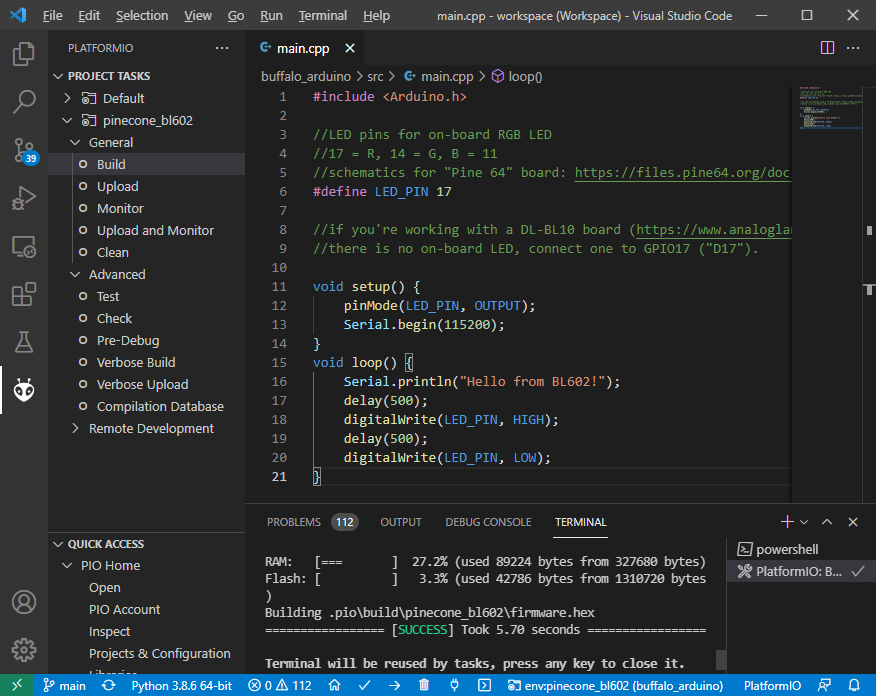

# PlatformIO + BL602 Bouffalo Arduino Core Test

## Description

Uses 
* A custom extension of the PlatformIO SiFive Platform (https://github.com/maxgerhardt/platform-sifive) for
  * the new `pinecone` board definition
  * support for flashing via b60x-flash
* the [Bouffalo Arduino core](https://github.com/pine64/ArduinoCore-bouffalo) in the version https://github.com/maxgerhardt/ArduinoCore-bouffalo
  * added PlatformIO builder script
  * added `package.json`
* the BL_IOT_SDK (a dependency of the Arduino core)
    * repackaged at https://github.com/maxgerhardt/pio-bl-iot-sdk-arduino
* the [BL60X flash tool](https://github.com/stschake/bl60x-flash)
    * repackaged at https://github.com/maxgerhardt/pio-bl60x-flash

## Import Project

Prerequisites: Have [PlatformIO installed in VSCode](https://docs.platformio.org/en/latest/integration/ide/vscode.html#installation).

Import project as normal via cloning this repository and "Open Project" via [PIO Home](https://docs.platformio.org/en/latest/home/index.html#welcome-project-manager)

Use the [project environment switcher](https://docs.platformio.org/en/latest/integration/ide/vscode.html#project-tasks) to switch the newly imported project's "env:pinecone_bl602" environment.

Use the [project tasks](https://docs.platformio.org/en/latest/integration/ide/vscode.html#project-tasks) "Build", "Upload" and "Upload and Monitor" as normal.

The standard [platformio.ini options](https://docs.platformio.org/en/latest/projectconf/section_env.html#environment-env-name) apply, e.g. `upload_port = COM3`, `build_flags`, etc.

No special extra options are needed to build or upload this project -- the upload serial port is even detected automatically.

## Uploading

The upload happens via a serial connection and an on-board USB-UART chip on many development boards. It may be necessary to put the board into UART download / bootloader mode. 

For the [Pine64 board](https://files.pine64.org/doc/Pinenut/Pine64%20BL602%20EVB%20Schematic%20ver%201.1.pdf) e.g., the GPIO8 pin (determines whether to start bootloader mode on powerup or not) is available on header J3 and must be connected to 3.3V (position 1-2), then a reset must be issued via the reset button.

Other boards like the [DT-BL10](https://raw.githubusercontent.com/SmartArduino/Doiting_BL/master/board/DT-BL10%20User%20Mannual.pdf) have the "D8" (=GPIO8) pin directly on a button on the board, akin to the "FLASH" and "RST" button on ESP8266 and ESP32 boards. The reset-into-bootloader-mode prodedure is the same: Hold D8, press RST once (while D8 is being held), release D8.

## Media



## Expected Build Output

```
Processing pinecone_bl602 (platform: https://github.com/maxgerhardt/platform-sifive.git; board: pinecone; framework: arduino)
--------------Verbose mode can be enabled via `-v, --verbose` option
CONFIGURATION: https://docs.platformio.org/page/boards/sifive/pinecone.html
PLATFORM: SiFive (4.1.0+sha.ed37f76) > PineCone (BL602)
HARDWARE: SIVIFE_E24 192MHz, 320KB RAM, 1.25MB Flash
DEBUG: Current (qemu) On-board (qemu) External (ftdi, jlink, minimodule, olimex-arm-usb-ocd, olimex-arm-usb-ocd-h, olimex-arm-usb-tiny-h, olimex-jtag-tiny, tumpa)
PACKAGES:
 - framework-arduinobouffalo 5.1.210913+sha.b5fe9fd
 - framework-bl-iot-sdk-arduino 5.1.210913+sha.012b766
 - toolchain-riscv 1.80300.190927 (8.3.0)
LDF: Library Dependency Finder -> http://bit.ly/configure-pio-ldf
LDF Modes: Finder ~ chain, Compatibility ~ soft
Found 2 compatible libraries
Scanning dependencies...
No dependencies
Building in release mode
WARNING: You are using pip version 21.1.3; however, version 21.2.4 is available.
You should consider upgrading via the 'c:\users\max\appdata\local\programs\python\python38\python.exe -m pip install --upgrade pip' command.
Compiling .pio\build\pinecone_bl602\src\main.cpp.o
Compiling .pio\build\pinecone_bl602\FrameworkArduino\HardwareSerial.cpp.o
Compiling .pio\build\pinecone_bl602\FrameworkArduino\Print.cpp.o
Compiling .pio\build\pinecone_bl602\FrameworkArduino\Stream.cpp.o
Compiling .pio\build\pinecone_bl602\FrameworkArduino\StreamString.cpp.o
Compiling .pio\build\pinecone_bl602\FrameworkArduino\WString.cpp.o     
Compiling .pio\build\pinecone_bl602\FrameworkArduino\bl602-hal-gpio.c.o
Compiling .pio\build\pinecone_bl602\FrameworkArduino\bl602-hal-misc.c.o
C:\Users\Max\.platformio\packages\framework-arduinobouffalo\cores\bl602\bl602-hal-gpio.c: In function 'digitalRead':
C:\Users\Max\.platformio\packages\framework-arduinobouffalo\cores\bl602\bl602-hal-gpio.c:25:34: warning: passing argument 2 of 'bl_gpio_input_get' from incompatible pointer type [-Wincompatible-pointer-types]
     ret = bl_gpio_input_get(pin, &val);
                                  ^~~~
In file included from C:\Users\Max\.platformio\packages\framework-arduinobouffalo\cores\bl602\bl602-hal-gpio.c:5:
C:\Users\Max\.platformio\packages\framework-bl-iot-sdk-arduino\include\hal_drv\bl602_hal/bl_gpio.h:47:45: note: expected 'uint8_t *' {aka 'unsigned char *'} but argument is of type 'int *'
 int bl_gpio_input_get(uint8_t pin, uint8_t *value);
                                    ~~~~~~~~~^~~~~
Compiling .pio\build\pinecone_bl602\FrameworkArduino\bl602-hal-pwm.c.o
Compiling .pio\build\pinecone_bl602\FrameworkArduino\main.cpp.o
Compiling .pio\build\pinecone_bl602\FrameworkArduino\stdlib_noniso.c.o
C:\Users\Max\.platformio\packages\framework-arduinobouffalo\cores\bl602\bl602-hal-pwm.c: In function 'analogWrite':
C:\Users\Max\.platformio\packages\framework-arduinobouffalo\cores\bl602\bl602-hal-pwm.c:43:1: warning: control reaches end of non-void function [-Wreturn-type]
 }
 ^
C:/Users/Max/.platformio/packages/framework-arduinobouffalo/cores/bl602/Print.cpp: In member function 'size_t Print::printf(const char*, ...)':
C:/Users/Max/.platformio/packages/framework-arduinobouffalo/cores/bl602/Print.cpp:61:12: warning: comparison of integer expressions of different signedness: 'int' and 'unsigned int' [-Wsign-compare]
     if(len >= sizeof(loc_buf)){
        ~~~~^~~~~~~~~~~~~~~~~~
Archiving .pio\build\pinecone_bl602\libFrameworkArduino.a
Indexing .pio\build\pinecone_bl602\libFrameworkArduino.a
Linking .pio\build\pinecone_bl602\firmware.elf
Checking size .pio\build\pinecone_bl602\firmware.elf
Advanced Memory Usage is available via "PlatformIO Home > Project Inspect"
RAM:   [===       ]  27.2% (used 89224 bytes from 327680 bytes)
Flash: [          ]   3.3% (used 42786 bytes from 1310720 bytes)
Building .pio\build\pinecone_bl602\firmware.hex
========================= [SUCCESS] Took 5.73 seconds =========================
```

## Expected Upload Output

**Make sure** your board is in bootoader mode before uploading, as described before.

"Verbose Upload":

```
<lambda>(["upload"], [".pio\build\pinecone_bl602\firmware.bin"])
AVAILABLE: bl60x-flash, ftdi, jlink, minimodule, olimex-arm-usb-ocd, olimex-arm-usb-ocd-h, olimex-arm-usb-tiny-h, olimex-jtag-tiny, tumpa
CURRENT: upload_protocol = bl60x-flash
MethodWrapper(["upload"], [".pio\build\pinecone_bl602\firmware.bin"])
Auto-detected: COM15
"c:\users\max\appdata\local\programs\python\python38\python.exe" "C:\Users\Max\.platformio\packages\tool-bl60x-flash\bl602-flasher.py" "COM15" ".pio\build\pinecone_bl602\firmware.bin"
Loading helper binary
21872 bytes @ 0x22010000

  0%|          | 0.00/21.9k [00:00<?, ?byte/s]
 37%|███▋      | 8.16k/21.9k [00:00<00:00, 50.0kbyte/s]
 75%|███████▍  | 16.3k/21.9k [00:00<00:00, 48.1kbyte/s]
100%|██████████| 21.9k/21.9k [00:00<00:00, 48.0kbyte/s]
100%|██████████| 21.9k/21.9k [00:00<00:00, 48.3kbyte/s]

Erased 47100 bytes @ 0x10000
Programming 47100 bytes @ 0x1000
0
  0%|          | 0.00/47.1k [00:00<?, ?byte/s]
 30%|███       | 14.3k/47.1k [00:00<00:00, 134kbyte/s]
 61%|██████    | 28.7k/47.1k [00:00<00:00, 134kbyte/s]
 91%|█████████▏| 43.0k/47.1k [00:00<00:00, 134kbyte/s]
100%|██████████| 47.1k/47.1k [00:00<00:00, 135kbyte/s]
Verified by XIP SHA256 hash
=============================== [SUCCESS] Took 6.83 seconds ===============================
```